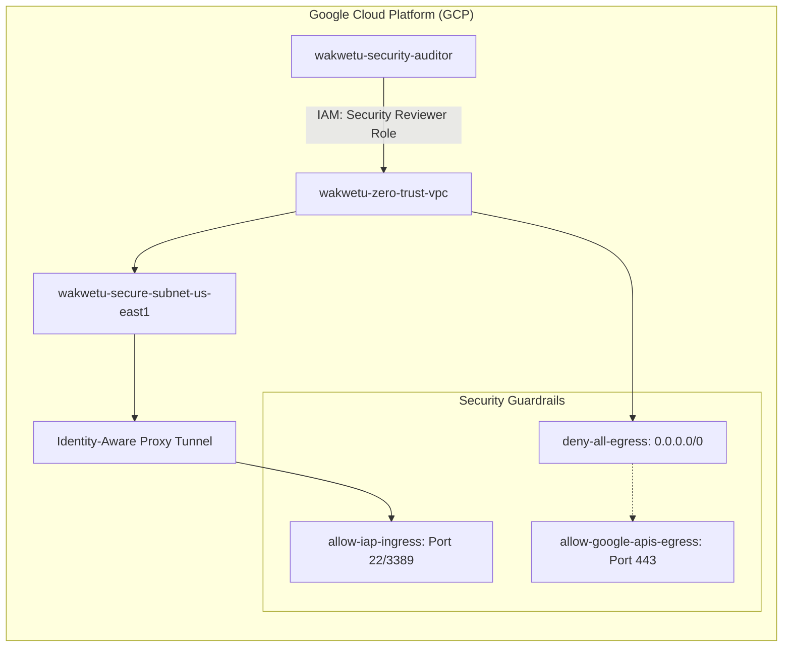
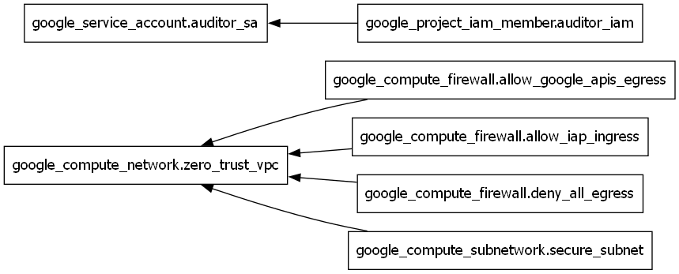

# Enterprise Zero-Trust Governance Shield (GCP)
**Lead Enterprise Solutions Architect:** Dan Alwende, PMP

---

## 🏗️ Executive Summary
This project represents a "Sovereign Architect" approach to cloud security, moving beyond standard vendor defaults to a custom-hardened governance model. By implementing **Zero-Trust Architecture** on Google Cloud Platform, we have established an identity-centric perimeter that secures high-integrity workloads against unauthorized data exfiltration and lateral movement.

## 🛡️ Technical Architecture (Live System Map)
The following diagram represents the logical infrastructure and security guardrails codified via the **Terraform IaC Factory**.

## 💎 Key Deliverables & Security Posture
- **Identity-as-the-Perimeter:** Management access is restricted to Google's Identity-Aware Proxy (IAP), eliminating the need for public IP addresses or Bastion hosts.
- **Data Exfiltration Shield:** A "Default-Deny" egress posture ensures that no data can leave the network unless it is routed through a specific, restricted Google API range.
- **Private Google Access:** Enabled VPC-to-API communication, ensuring services stay within the Google backbone.
- **Least-Privilege Governance:** Automated Service Account provisioning with audited permissions for security reviewers.

## 🚀 Governance & Deployment
The entire environment is 100% declarative and was provisioned using the following IaC lifecycle:

1. **Initialization:** `terraform init` (Provider Sync)
2. **Validation:** `terraform plan` (Pre-flight Audit)
3. **Execution:** `terraform apply` (Immutable Provisioning)

---

## 📁 Project Portfolio Files
- **[Project Charter](./Project_Charter_GCP_ZeroTrust.md):** Formal authorization and project scope.
- **[Closure Report](./Project_Closure_Report.md):** Executive value realization and KPI audit.
- **[Architecture Graph](./screenshots/architecture_graph.dot):** Logical dependency map.

---
*Developed for the Wakwetu Executive Project Portfolio.*

## 📸 Architectural Evidence (Terraform Render)
This diagram is auto-generated directly from the Terraform state, ensuring 100% parity between the documentation and the live environment.

