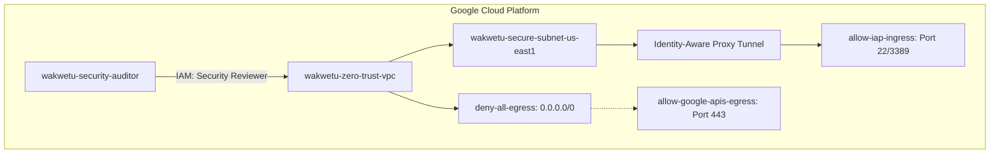

# Enterprise Zero-Trust Governance Shield (GCP)
**Lead Architect:** Dan Alwende, PMP

## 🏗️ Technical Architecture (Live Render)


## 🛡️ Security Posture (Zero-Trust)
- **Identity-as-the-Perimeter:** Management access restricted to Google IAP.
- **Data Exfiltration Shield:** Default-deny egress posture with restricted API routing.
- **Private Google Access:** Direct VPC-to-API communication (No Public IPs).

## 🚀 Governance Execution
```bash
terraform init
terraform apply
```

---
*Verified by the Sovereign Architecture Factory.*
